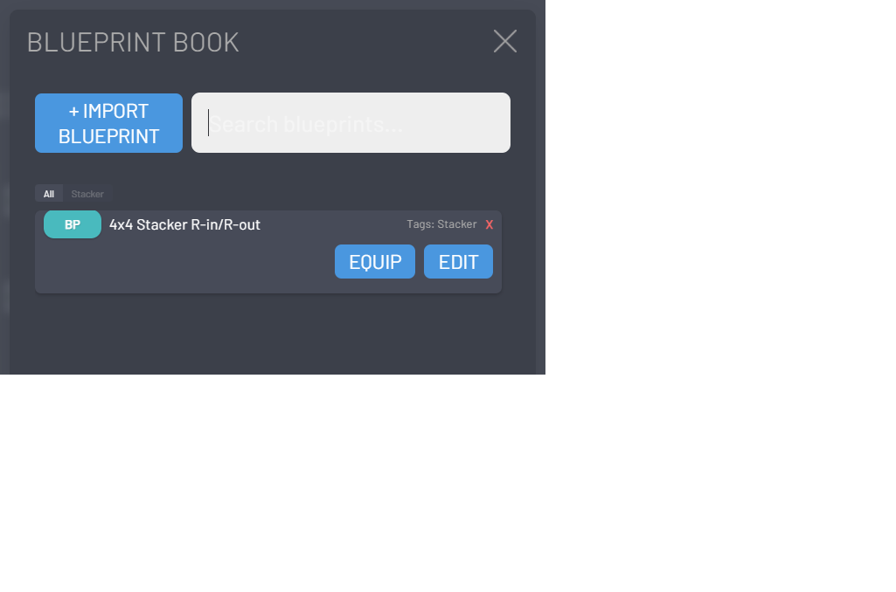

# Blueprint Book

This is a complete rewrite of KiitikM's original Blueprint Library mod for shapez. It fixes the prior memory leaks and integrates the interface natively into the game. I built a tagging and filtering system backed by a unified state store to handle large collections of blueprint strings. The dialog wires directly into the HUDGameMenu. It correctly intercepts input bubbling during text entry, so you don't accidentally trigger background game actions while typing.

You need to install the `bp-string` mod alongside this one. The codebase relies on its deserializer to equip layouts directly into your game cursor. The minimum game version required is 1.5.0. The BlueprintStore manages local persistence and automatically prunes orphaned tags when you update or delete a saved entry.

**Installation**
1. Download the repository archive as a zip file.
2. Extract the folder contents.
3. Drop the extracted folder into your local mod directory, which you can locate by selecting "Open Mod Folder" from inside the game menu.
